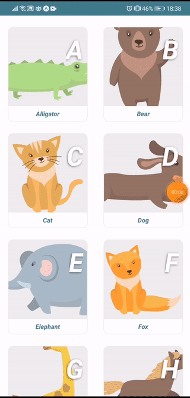

# [Nustart - kids ABCs and animal app](https://github.com/SaintClever/nustart)

## [https://github.com/SaintClever/nustart](https://github.com/SaintClever/nustart)

- Application created to teach kids there ABC's alongside the corresponding names and characteristics of those animals
- Created with react native and axios
- Animal descriptions obtained from vikidia

## Available Scripts

In the project directory run:

### `expo start, yarn start or npm start`